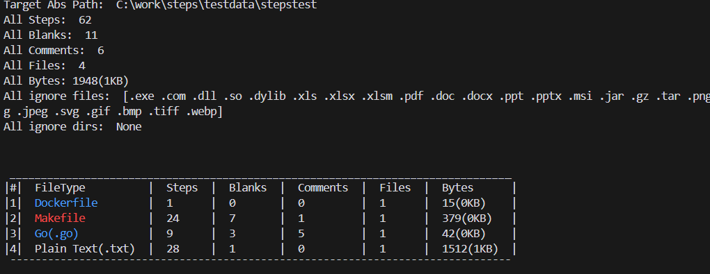

# steps

[](https://github.com/suwakei/steps/actions/workflows/ci.yml)
[](https://github.com/suwakei/steps/actions/workflows/lint.yml)

## Overview
steps is a CLI application that counts the number of lines, blanks, etc. in the file of the input path and outputs them.

## Table of Contents
- [Overview](#overview)
- [Example](#example)
- [Features](#features)
- [Installation](#installation)
- [Usage](#usage)
    - [Supported Extentions](#supported-extentions)
    - [Supported Options](#supported-options)

## Example


## Features

## Installation

## Usage

### Supported Extentions

### Supported Options
```bash
Usage:
  steps [PATH] [OPTIONS] [flags]

Flags:
  -d, --dist strings    input filepath to output. output format [.json, .jsonc, .yml, .yaml, .toml, .txt]
  -e, --ext strings     input extension you don't want to count "-e=test.json, .js, .go" or "-e=test.json -e=.js -e=.go". (default: .exe, .com, .dll, .so, .dylib, .xls, .xlsx, .pdf, .doc, .docx, .ppt, .pptx)
  -h, --help            help for steps
  -i, --ignore string   input your .gitignore file path. ignore extentions in .gitignore file. (default: .gitignore)
  -o, --only string     By specifying an extension or file name, only files with that extension or name are targeted. "-o=.go" or "-o .go" or "-o=test.txt"
  -v, --version         Print version of this app
```